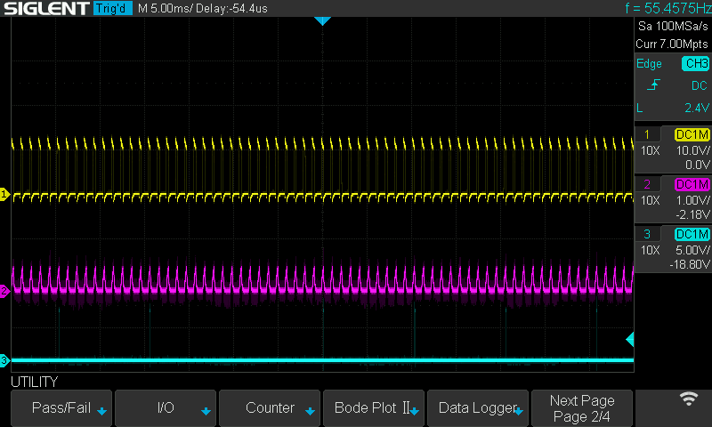
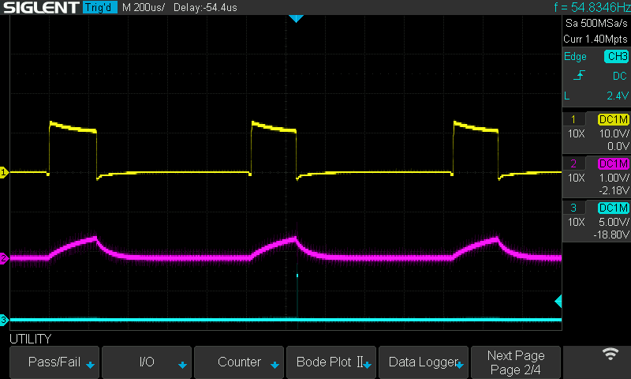
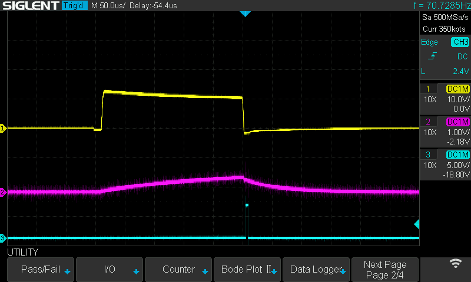

This page explains how I'm timing the ADC measurement of the MC33887's current feedback pin. I'm timing the ADC measurement via the timer0 output compare interrupt service routine (ISR).

 * CH1 (yellow): motor output (0 to 12v)
 * CH2 (red): driver feedback pin
 * CH3 (blue): strobe showing when ADC conversion for feedback read is complete
   * the ADC measurement is initiated on falling edge of motor output via output compare ISR

This screenshot shows that I'm reading the current feedback pin every 10ms (every PID control interval). The Arduino's PWM frequency is \~1KHz, so you can see the blue acquisition strobe occurs about every 10 PWM cycles.

These next two screenshots show how the ADC acquisition is precisly timed based on the PWM signal. I'm controlling the MC33887 with Arduino digital pins 5 and 6. These pins have PWM functionality that's driven by the Atmega328's timer0. The Wiring library's `analogWrite()` method configures these pins to "Fast PWM" mode where it sets the output compare pin on timer0 BOTTOM (overflow), and clears the pin on output compare match. In [adc_ctrl.cpp](/src/avr/EThrottle/adc_ctrl.cpp), I have an ISR for `TIMER0_COMPA_vect` and `TIMER0_COMPB_vect` that initiate ADC collection near the motor driver's peak current. While the measurement isn't reading the absolute peak current, it's better than nothing.

